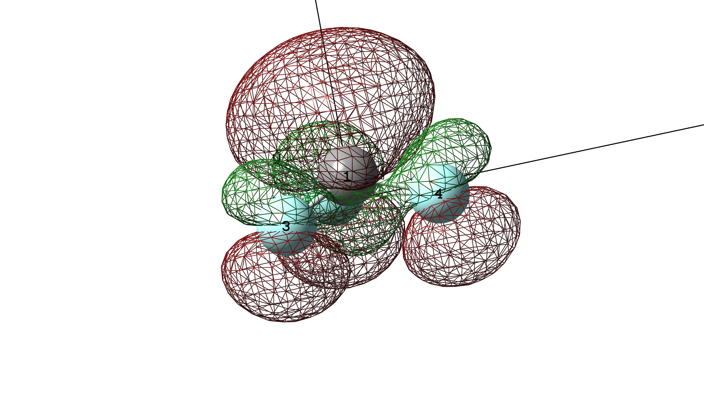

# 3.28
## 两原子间两个个节点

- 非占据轨道中有时两个原子之间会出现两个节面，程序会误判为π轨道
- 计算两原子间波函数的叠加，平方后出现两堆零值点即可排除
- 因为用的6-31G(d),所以会有d的贡献，导致出现这种图像
- 计算某个轨道所有原子的s轨道贡献和d轨道贡献(如果存在的话)之和，大于0.4就不是Π轨道
# 4.1
## CF3挑选不出HOMO轨道
- CF3的HOMO轨道S组分偏多，导致没有挑选出来
- 计算某个原子所有轨道的s成分贡献之和作为总贡献,并且只使用1s

# 4.5
## 成键轨道与反键轨道的判别
- 之前使用角度判断的，但是有的地方判断出错
- 现在用叠加前后函数值的变化来判断，用键轴中心空间格点函数值平方后的均值

# 4.10
## 成键轨道与反键轨道的判别
- 之前只使用正波函数处的值变化来判断成键或反键，具有局限性,例如以下情况挑选不出来

- 根据中心原子空间格点的函数值叠加前后的平方均值的变化，来判断成键还是反键

## 成键轨道与反键轨道的判别
- 在键轴中心处，1为半径，选择一个球形空间，并将球形空间的点分别代入两个原子的波函数，并计算波函数的波函数叠加前后

# 4.13
## p轨道方向的复杂性
- 一个原子所有分子轨道对应的原子p轨道的方向似乎是分布很随机的，以萘和八元环为例

萘的1号碳原子的所有p轨道方向

八元环的1号碳原子的所有p轨道方向

# 4.14
## 判断成键轨道与反键轨道的方法再次改变
- 对于CF3，虽然是反键轨道，但由于两个负的部分离得近，导致只有负的部分发生了重叠(如下图所示)，按照之前的方式会判断为成键轨道，所以要修改方法

- 根据两原子p轨道的方向向量的夹角来判断，如果两向量夹角小于90°，则是成键轨道，如果p轨道的方向